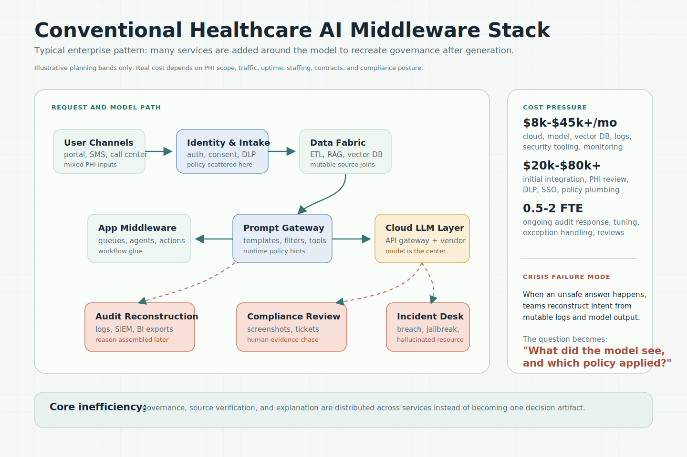
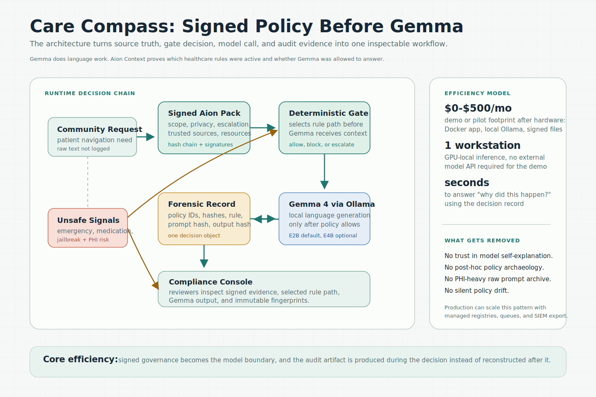
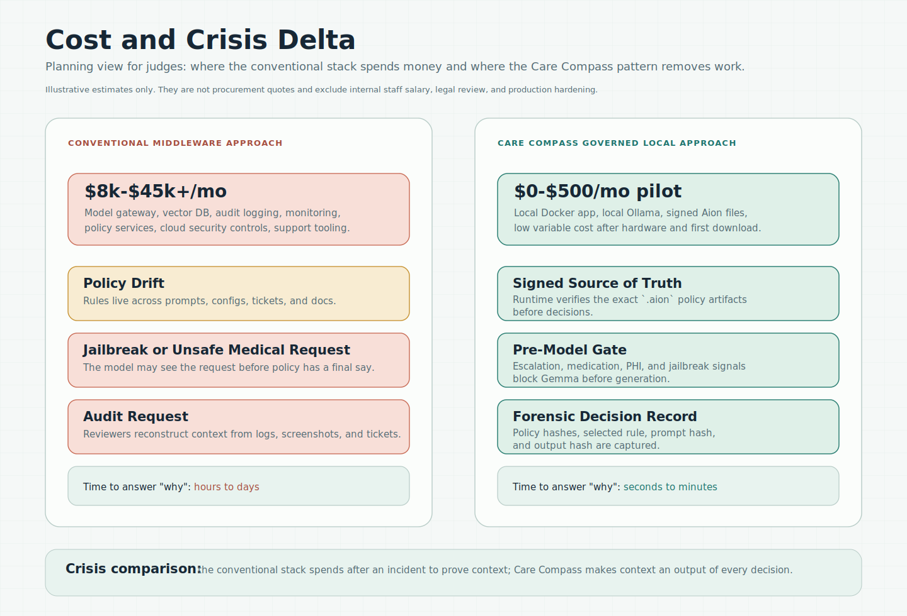

# Architecture Diagrams

These assets frame the Care Compass submission for reviewers who want to see
the ecosystem impact, not just the working demo. The diagrams use planning
bands, not vendor quotes.

## 1. Conventional Ecosystem

This diagram shows the typical middleware-heavy pattern for healthcare AI:
intake services, PHI controls, data fabric, prompt gateways, cloud model
routing, logging, SIEM exports, and compliance reconstruction.

The cost pressure comes from duplicated governance work:

- policy is spread across prompts, filters, tickets, and documents,
- audit evidence is reconstructed after output,
- model output becomes a central object of trust,
- incident response has to recover context from mutable systems.

Illustrative planning band:

- `20k-80k+` initial implementation and controls,
- `8k-45k+/month` for infrastructure and platform services,
- `0.5-2 FTE` equivalent ongoing review and operations load.

## 2. Care Compass Ecosystem

This diagram shows the project architecture:

- signed Aion policy artifacts are verified before decisions,
- deterministic rules decide whether Gemma may run,
- Gemma 4 handles only allowed language/navigation work,
- every path emits a forensic decision record,
- reviewers inspect policy IDs, hashes, selected rule, model call status, and
  model output fingerprints in one place.

Illustrative pilot band:

- `0-500/month` after hardware for a local pilot/demo profile,
- one Docker stack with local Ollama and signed files,
- low variable cost because the model is local and unsafe requests do not call
  Gemma.

## 3. Cost And Crisis Delta

The comparison is the strongest judging point: the project does not merely
reduce model spend. It changes when evidence is created.

In the conventional stack, a crisis asks:

> What did the model see, what policy applied, and why was the response allowed?

In Care Compass, that answer exists as part of the decision object:

- verified policy fingerprints,
- selected rule and candidate matches,
- request hash without raw PHI retention,
- model payload hash,
- model output hash,
- whether Gemma was called at all.

## Publishing Fallbacks

The SVG files are the editable source assets. PNG exports are committed beside
them for article platforms that do not accept SVG upload or do not render
external SVGs consistently:

- `assets/conventional-health-ai-ecosystem.png`
- `assets/care-compass-forensic-ecosystem.png`
- `assets/cost-risk-comparison.png`

## Assumptions

These are not pricing claims. They are presentation ranges for comparison:

- Local demo cost excludes the workstation or GPU already used to run the demo.
- Enterprise cost ranges assume regulated data handling, security review,
  logging, monitoring, cloud model or GPU access, and compliance operations.
- Production Care Compass could still add managed storage, SIEM export,
  HA deployment, and review workflow tooling; the efficiency comes from making
  signed policy and decision evidence first-class runtime artifacts.
